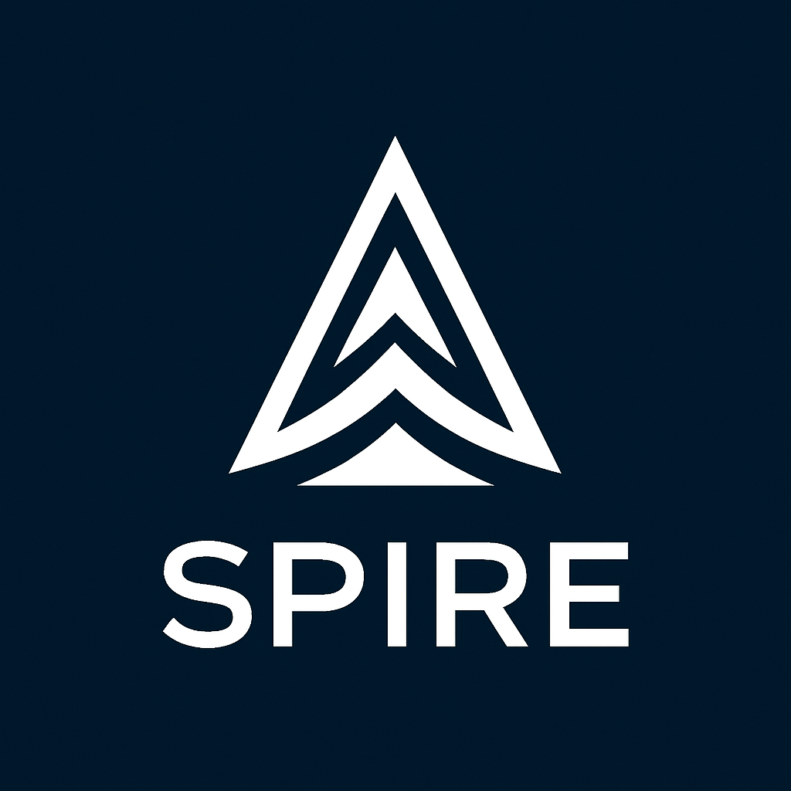
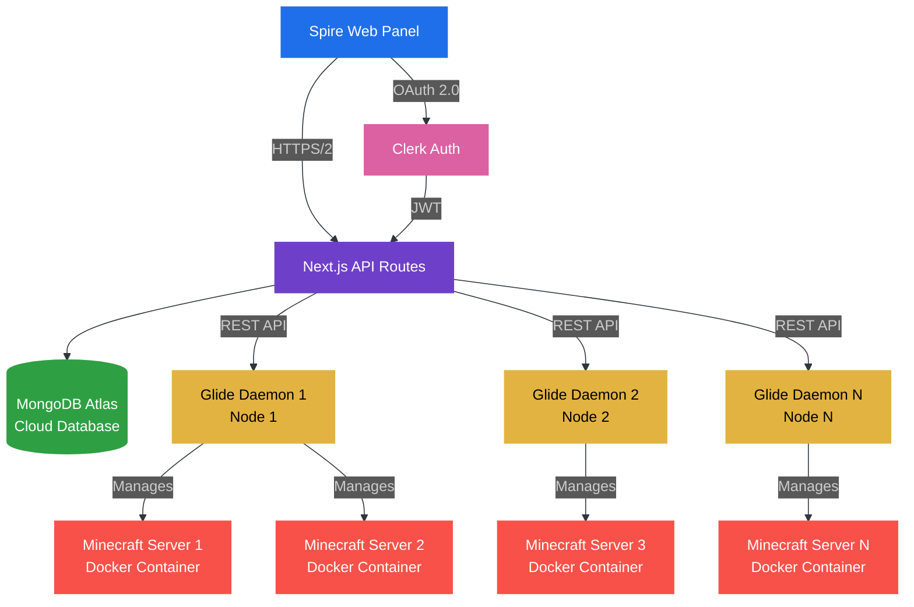

<!-- Dark mode styling -->
<style>
  .markdown-body {
    color: #e1e4e8;
    background-color: #0d1117;
    max-width: 1200px;
    margin: 0 auto;
    padding: 2rem;
    font-family: -apple-system, BlinkMacSystemFont, "Segoe UI", Roboto, Helvetica, Arial, sans-serif;
    line-height: 1.6;
  }
  
  .markdown-body h1, 
  .markdown-body h2, 
  .markdown-body h3, 
  .markdown-body h4, 
  .markdown-body h5, 
  .markdown-body h6 {
    color: #58a6ff;
    margin-top: 1.5em;
    margin-bottom: 0.5em;
  }
  
  .markdown-body h1 {
    font-size: 2.5em;
    border-bottom: 1px solid #30363d;
    padding-bottom: 0.3em;
  }
  
  .markdown-body h2 {
    font-size: 2em;
    border-bottom: 1px solid #30363d;
    padding-bottom: 0.3em;
  }
  
  .markdown-body a {
    color: #58a6ff;
    text-decoration: none;
  }
  
  .markdown-body a:hover {
    text-decoration: underline;
  }
  
  .markdown-body pre {
    background-color: #161b22;
    border: 1px solid #30363d;
    border-radius: 6px;
    padding: 1em;
    overflow-x: auto;
  }
  
  .markdown-body code {
    color: #8b949e;
    background-color: rgba(110, 118, 129, 0.4);
    border-radius: 3px;
    padding: 0.2em 0.4em;
    font-family: ui-monospace, SFMono-Regular, SF Mono, Menlo, Consolas, Liberation Mono, monospace;
    font-size: 85%;
  }
  
  .markdown-body pre code {
    background-color: transparent;
    padding: 0;
    color: #e1e4e8;
  }
  
  .markdown-body table {
    border: 1px solid #30363d;
    border-collapse: collapse;
    width: 100%;
    margin: 1em 0;
  }
  
  .markdown-body th, 
  .markdown-body td {
    border: 1px solid #30363d;
    padding: 0.5em 1em;
  }
  
  .markdown-body th {
    background-color: #161b22;
    text-align: left;
  }
  
  .markdown-body tr {
    background-color: #0d1117;
    border-top: 1px solid #21262d;
  }
  
  .markdown-body tr:nth-child(2n) {
    background-color: #161b22;
  }
  
  .markdown-body blockquote {
    border-left: 4px solid #30363d;
    color: #8b949e;
    margin: 1em 0;
    padding: 0 1em;
  }
  
  .markdown-body img {
    max-width: 100%;
    height: auto;
  }
  
  .header-badges {
    margin: 20px 0;
  }
  
  .header-badges img {
    margin: 0 5px;
    height: 28px;
  }
  
  .feature-grid {
    display: grid;
    grid-template-columns: repeat(auto-fit, minmax(300px, 1fr));
    gap: 1.5rem;
    margin: 2rem 0;
  }
  
  .feature-card {
    background-color: #161b22;
    border: 1px solid #30363d;
    border-radius: 6px;
    padding: 1.5rem;
  }
  
  .feature-card h3 {
    margin-top: 0;
    display: flex;
    align-items: center;
    gap: 0.5rem;
  }
  
  .feature-card ul {
    margin: 0.5rem 0 0 0;
    padding-left: 1.5rem;
  }
  
  .tech-stack {
    background-color: #161b22;
    border: 1px solid #30363d;
    border-radius: 6px;
    padding: 1.5rem;
    margin: 2rem 0;
  }
  
  .tech-stack h3 {
    margin-top: 0;
  }
  
  .tech-stack-grid {
    display: grid;
    grid-template-columns: repeat(auto-fill, minmax(200px, 1fr));
    gap: 1rem;
  }
  
  .tech-item {
    display: flex;
    align-items: center;
    gap: 0.5rem;
    padding: 0.5rem;
    background-color: #0d1117;
    border: 1px solid #30363d;
    border-radius: 4px;
  }
  
  .tech-item img {
    width: 24px;
    height: 24px;
  }
  
  .footer {
    margin-top: 4rem;
    padding-top: 2rem;
    border-top: 1px solid #30363d;
    text-align: center;
    color: #8b949e;
  }
  
  .footer-links {
    display: flex;
    justify-content: center;
    gap: 1.5rem;
    margin-top: 1rem;
  }
  
  .footer-links a {
    color: #58a6ff;
    text-decoration: none;
    display: flex;
    align-items: center;
    gap: 0.5rem;
  }
  
  .footer-links a:hover {
    text-decoration: underline;
  }
  
  .command {
    background-color: #161b22;
    border: 1px solid #30363d;
    border-radius: 6px;
    padding: 1rem;
    font-family: ui-monospace, SFMono-Regular, SF Mono, Menlo, Consolas, Liberation Mono, monospace;
    margin: 1rem 0;
    position: relative;
  }
  
  .command:before {
    content: "$";
    color: #58a6ff;
    margin-right: 0.5rem;
  }
  
  .note {
    background-color: rgba(88, 166, 255, 0.1);
    border-left: 4px solid #58a6ff;
    padding: 1rem;
    margin: 1.5rem 0;
    border-radius: 0 6px 6px 0;
  }
  
  .note p:first-child {
    margin-top: 0;
  }
  
  .note p:last-child {
    margin-bottom: 0;
  }
  
  .warning {
    background-color: rgba(248, 81, 73, 0.1);
    border-left: 4px solid #f85149;
    padding: 1rem;
    margin: 1.5rem 0;
    border-radius: 0 6px 6px 0;
  }
  
  .warning p:first-child {
    margin-top: 0;
  }
  
  .warning p:last-child {
    margin-bottom: 0;
  }
</style>

<div align="center">
  
  <h1>Spire</h1>
  <h3>Minecraft Server Management Platform</h3>
  
  <div class="header-badges">
    
    
    
    
    
    
  </div>
</div>

## 🌐 System Architecture



## 🚀 Features

<div class="feature-grid">
  <div class="feature-card">
    <h3>🚀 Server Management</h3>
    <ul>
      <li>Multi-Node Deployment</li>
      <li>Docker Containerization</li>
      <li>One-Click Operations</li>
      <li>Resource Allocation</li>
      <li>Automated Backups</li>
    </ul>
  </div>
  
  <div class="feature-card">
    <h3>📊 Monitoring</h3>
    <ul>
      <li>Real-time Metrics</li>
      <li>Player Tracking</li>
      <li>Performance Analytics</li>
      <li>Automated Alerts</li>
      <li>Log Viewer</li>
    </ul>
  </div>
  
  <div class="feature-card">
    <h3>🔐 Security</h3>
    <ul>
      <li>Role-Based Access</li>
      <li>Clerk Authentication</li>
      <li>Activity Logs</li>
      <li>IP Whitelisting</li>
      <li>SSL Encryption</li>
    </ul>
  </div>
</div>

## 🛠️ Technical Stack

<div class="tech-stack">
  <h3>Frontend</h3>
  <div class="tech-stack-grid">
    <div class="tech-item">
      
      <span>Next.js 14</span>
    </div>
    <div class="tech-item">
      
      <span>React 19</span>
    </div>
    <div class="tech-item">
      
      <span>TypeScript</span>
    </div>
    <div class="tech-item">
      
      <span>Tailwind CSS</span>
    </div>
  </div>
  
  <h3 style="margin-top: 2rem;">Backend</h3>
  <div class="tech-stack-grid">
    <div class="tech-item">
      
      <span>Node.js 18+</span>
    </div>
    <div class="tech-item">
      
      <span>MongoDB</span>
    </div>
    <div class="tech-item">
      
      <span>Docker</span>
    </div>
    <div class="tech-item">
      
      <span>Clerk Auth</span>
    </div>
  </div>
</div>

## 🚀 Getting Started

### Prerequisites

- Node.js 18+ (LTS recommended)
- MongoDB 6.0+
- Docker 24.0+
- pnpm 8.x

### Installation

1. **Clone the repository**

   ```bash
   git clone https://github.com/your-username/spire.git
   cd spire
   ```

2. **Install dependencies**

   ```bash
   pnpm install
   ```

3. **Set up environment variables**

   ```bash
   cp .env.example .env
   # Edit .env with your configuration
   ```

4. **Start the development server**

   ```bash
   pnpm dev
   ```

5. **Access the dashboard**

   Open [http://localhost:3000](http://localhost:3000) in your browser

<div class="note">
  <p><strong>Note:</strong> Make sure you have all the required environment variables set in your <code>.env</code> file before starting the application.</p>
</div>

## 🏗️ Project Structure

```
spire/
├── public/            # Static assets and media
│   └── assets/        # Images, fonts, etc.
├── src/
│   ├── actions/       # Server actions and API handlers
│   │   ├── clerk.actions.ts   # Auth-related actions
│   │   ├── db.actions.ts      # Database operations
│   │   └── roles.actions.ts   # Role management
│   ├── app/           # Next.js app router
│   │   ├── api/       # API routes
│   │   ├── (auth)/    # Authentication pages
│   │   ├── dashboard/ # Dashboard pages
│   │   └── layout.tsx # Root layout
│   ├── components/    # Reusable UI components
│   │   ├── ui/        # Base UI components
│   │   ├── dashboard/ # Dashboard components
│   │   ├── files/     # File management components
│   │   ├── nodes/     # Node management components
│   │   ├── onboarding/ # Onboarding components
│   │   ├── server/    # Server management components
│   │   └── settings/    # Settings components
│   ├── config/        # Environment configuration
│   ├── hooks/         # Custom hooks
│   ├── lib/           # Shared utilities
│   │   ├── models/        # Database models
│   │   ├── db.ts          # Database connection
│   │   ├── api-utils.ts   # API utilities
│   │   ├── middlewares.ts # API middlewares
│   │   ├── Roles.ts       # Role management
│   │   └── utils.ts       # Helper functions
│   └── types/         # TypeScript type definitions
├── .env.example       # Example environment variables
├── package.json       # Project dependencies and scripts
└── tsconfig.json     # TypeScript configuration
```

## 🤝 Contributing

We welcome contributions from the community! Here's how you can help:

1. **Report bugs** - Open an issue with detailed information
2. **Suggest features** - Share your ideas for improvements
3. **Submit pull requests** - Help us improve the codebase

### Development Workflow

1. Fork the repository
2. Create a feature branch (`git checkout -b feature/amazing`)
3. Commit your changes (`git commit -m 'Add amazing feature'`)
4. Push to the branch (`git push origin feature/amazing`)
5. Open a Pull Request

<div class="warning">
  <p><strong>Important:</strong> Please make sure to write tests for your changes and ensure all tests pass before submitting a PR.</p>
</div>

## 📄 License

This project is licensed under the MIT License - see the [LICENSE](LICENSE) file for details.

## 🙏 Acknowledgments

- [Next.js](https://nextjs.org/) - The React Framework
- [MongoDB](https://www.mongodb.com/) - The database for modern applications
- [Clerk](https://clerk.com/) - Authentication and User Management
- [Radix UI](https://www.radix-ui.com/) - Unstyled, accessible UI components
- [Lucide](https://lucide.dev/) - Beautiful & consistent icons
- [Tailwind CSS](https://tailwindcss.com/) - A utility-first CSS framework
- [TanStack Query](https://tanstack.com/query) - Data synchronization for React

---

<div class="footer">
  <p>Made with ❤️ by the Spire Team</p>
  
  <div class="footer-links">
    <a href="https://github.com/spire-panel/spire">
      <svg height="16" viewBox="0 0 16 16" width="16" fill="currentColor">
        <path d="M8 0C3.58 0 0 3.58 0 8c0 3.54 2.29 6.53 5.47 7.59.4.07.55-.17.55-.38 0-.19-.01-.82-.01-1.49-2.01.37-2.53-.49-2.69-.94-.09-.23-.48-.94-.82-1.13-.28-.15-.68-.52-.01-.53.63-.01 1.08.58 1.23.82.72 1.21 1.87.87 2.33.66.07-.52.28-.87.51-1.07-1.78-.2-3.64-.89-3.64-3.95 0-.87.31-1.59.82-2.15-.08-.2-.36-1.02.08-2.12 0 0 .67-.21 2.2.82.64-.18 1.32-.27 2-.27.68 0 1.36.09 2 .27 1.53-1.04 2.2-.82 2.2-.82.44 1.1.16 1.92.08 2.12.51.56.82 1.27.82 2.15 0 3.07-1.87 3.75-3.65 3.95.29.25.54.73.54 1.48 0 1.07-.01 1.93-.01 2.2 0 .21.15.46.55.38A8.013 8.013 0 0016 8c0-4.42-3.58-8-8-8z"></path>
      </svg>
      Spire GitHub
    </a>
    <a href="https://discord.gg/spire-panel">
      <svg height="16" viewBox="0 0 127.14 96.36" width="16" fill="currentColor">
        <path d="M107.7,8.07A105.15,105.15,0,0,0,81.47,0a72.06,72.06,0,0,0-3.36,6.83A97.68,97.68,0,0,0,49,6.83,72.37,72.37,0,0,0,45.64,0,105.89,105.89,0,0,0,19.39,8.09C2.79,32.65-1.71,56.6.54,80.21h0A105.73,105.73,0,0,0,32.71,96.36,77.7,77.7,0,0,0,39.6,85.25a68.42,68.42,0,0,1-10.85-5.18c.91-.66,1.8-1.34,2.66-2a75.57,75.57,0,0,0,64.32,0c.87.71,1.76,1.39,2.66,2a68.68,68.68,0,0,1-10.87,5.19,77,77,0,0,0,6.89,11.1A105.25,105.25,0,0,0,126.6,80.22h0C129.24,52.84,122.09,29.11,107.7,8.07ZM42.45,65.69C36.18,65.69,31,60,31,53s5-12.74,11.43-12.74S54,46,53.89,53,48.84,65.69,42.45,65.69Zm42.24,0C78.41,65.69,73.25,60,73.25,53s5-12.74,11.44-12.74S96.23,46,96.12,53,91.08,65.69,84.69,65.69Z"></path>
      </svg>
      Discord
    </a>
    <a href="https://github.com/spire-panel/glide">
      <svg height="16" viewBox="0 0 16 16" width="16" fill="currentColor">
        <path d="M8 0C3.58 0 0 3.58 0 8c0 3.54 2.29 6.53 5.47 7.59.4.07.55-.17.55-.38 0-.19-.01-.82-.01-1.49-2.01.37-2.53-.49-2.69-.94-.09-.23-.48-.94-.82-1.13-.28-.15-.68-.52-.01-.53.63-.01 1.08.58 1.23.82.72 1.21 1.87.87 2.33.66.07-.52.28-.87.51-1.07-1.78-.2-3.64-.89-3.64-3.95 0-.87.31-1.59.82-2.15-.08-.2-.36-1.02.08-2.12 0 0 .67-.21 2.2.82.64-.18 1.32-.27 2-.27.68 0 1.36.09 2 .27 1.53-1.04 2.2-.82 2.2-.82.44 1.1.16 1.92.08 2.12.51.56.82 1.27.82 2.15 0 3.07-1.87 3.75-3.65 3.95.29.25.54.73.54 1.48 0 1.07-.01 1.93-.01 2.2 0 .21.15.46.55.38A8.013 8.013 0 0016 8c0-4.42-3.58-8-8-8z"></path>
      </svg>
      Glide Github
    </a>
  </div>
  
  <p style="margin-top: 2rem; font-size: 0.9em; color: #6e7681;">
    &copy; 2025 Spire. All rights reserved.
  </p>
</div>
